### carship

A cross-shell prompt written in C. Works with bash, zsh and busybox ash.

Renders in about a millisecond, reads starship-compatible TOML configuration.

```
 󰣇  smn   ~/carship    main !2 +1    14:32   
❯ 
```

### Build

```sh
make              # build/carship
make static       # ~20% faster to start, see Performance
make test         # unit tests, CLI checks, every preset rendered
make install      # PREFIX=/usr/local
```

Requires clang and a POSIX system. No external libraries.

### Use

One line gives you the prompt, key bindings and shell completions. Add to
`~/.zshrc`:

```zsh
eval "$(carship init zsh)"
```

Or `~/.bashrc`:

```sh
eval "$(carship init bash)"
```

Or `~/.profile` for busybox ash:

```sh
eval "$(carship init ash)"
```

Set any of these *before* that line to opt out of a part:

```sh
export CARSHIP_NO_KEYBINDINGS=1   # leave your key bindings alone
export CARSHIP_NO_COMPLETION=1    # do not register completions
export CARSHIP_ANIMATE=1          # seconds between idle redraws (off by default)
```

Do not paste the output of `carship init` into your rc file. It is generated
for the binary that produced it, and a stale copy is how you end up with
`command not found: compdef` on a line of your own `.zshrc`.

### Presets

```sh
carship preset --list                     # what is available
carship preset set catppuccin-powerline   # make it the active configuration
carship preset tokyo                      # print one without installing it
carship preset tokyo -o somewhere.toml    # or write it anywhere
```

`preset set` overwrites the configuration file, so it copies the previous
contents to `<config>.bak` first.

| | |
| --- | --- |
| **Powerline themes** | `catppuccin-powerline`, `nord`, `dracula`, `rose-pine`, `everforest`, `kanagawa`, `gruvbox`, `tokyo`, `pastel`, `jetpack`, `k3ff_powahline`, `powahlinje`, `kl0ck0`, + added |
| **oh-my-zsh ports** | `trapd00r`, `agnoster`, `robbyrussell`, `bira`, `ys`, `wezm` ++ |
| **Restrained** | `quiet`, `minimal`, `two-line`, `pure`, `plain`, `nonerd`, `bracketed-segments`, `nerdfontsymbols`, `no-runtime-versions` + added |
| **Moving** | `animated`(just a starting point) |

### Configure

Configuration lives in `~/.config/carship.toml`, overridable with
`$CARSHIP_CONFIG`. The format follows starship's schema: a top-level `format`
string referencing `$module` names, a table per module, and `[palettes.<name>]`
colour definitions selected with `palette = "<name>"`.

```toml
format = "$directory$git_branch$character"
palette = "mine"

[directory]
truncation_length = 3
style = "bold cyan"

[palettes.mine]
accent = "#89b4fa"
```

Palette entries take precedence over the built-in colour names, so a theme can
redefine `green`, `red` and so on.

### Format strings

| Syntax | Meaning |
| --- | --- |
| `$module` | insert a module, or a variable inside a module's own format |
| `[text](style)` | style a run of text |
| `(text)` | drop the whole group if every variable in it came out empty |
| `\(` `\[` `\$` | a literal bracket or dollar sign |

Styles are space-separated: `bold`, `italic`, `underline`, `dimmed`,
`inverted`, `blink`, `strikethrough`, `hidden`, `fg:<colour>`, `bg:<colour>`,
`none`. A colour is a palette name, a built-in name (`red`, `bright-blue`), a
256-colour index (`245`), or a hex triplet (`#f38ba8`).

### Right-hand prompt

`right_format` works in zsh. carship only wires up `RPROMPT` when the
configuration actually defines one, so an unused right prompt costs nothing.

```toml
right_format = "$cmd_duration$time"
```

## Modules

`carship module --list` prints them all. `carship explain` is more useful: it
shows what each one is contributing right now, and why the quiet ones are
quiet.

```
$ carship explain
MODULE           OUTPUT
directory        ~/carship
git_branch       on  main
git_status       [!+?]
golang           - nothing to report here
tty              - off by default; set disabled = false to use it
```

Asking for one by name answers the same way rather than printing a blank line:

```
$ carship module golang
carship module: golang: nothing to report here
```

Every module takes `disabled`, `format` and `style`. Modules that detect a
toolchain also take `symbol`, `version_format` and `show_version`.

**Context** — `os`, `username`, `hostname`, `localip`, `shlvl`, `shell`,
`tty`, `directory`, `container`, `nix_shell`, `env_var`, `sudo`, `jobs`,
`cmd_duration`, `status`, `time`, `line_break`, `fill`, `character`

**Git** — `git_branch`, `git_state`, `git_status`, `git_metrics`

**Toolchains** — `bun`, `c`, `cpp`, `elixir`, `elm`, `golang`, `gradle`,
`haskell`, `java`, `julia`, `kotlin`, `maven`, `nim`, `nodejs`, `php`,
`python`, `rust`, `scala`, `conda`, `pixi`, `docker_context`

#### Animation

The `animation` module derives its frame from the wall clock, so every render
lands on the same frame without any shared state. Glyphs and colours cycle
independently, which is what makes a gradient possible.

```toml
[animation]
disabled = false
interval = 1000                        # ms per frame
frames = ["▁", "▂", "▃", "▄", "▅", "▆", "▇", "█"]
styles = ["fg:red", "fg:peach", "fg:yellow", "fg:green"]
format = "[$frame]($frame_style)"
```

A prompt only moves when the shell redraws it, which normally means once per
command. `CARSHIP_ANIMATE=1` adds an idle redraw once a second.

carship installs the `TRAPALRM` handler before setting `TMOUT`, because a
`TMOUT` with no handler makes zsh exit on timeout. The handler calls `zle` with
no arguments first, which is false unless the line editor is waiting for input,
so redraws stay clear of running commands. A half-typed line survives them.

##### Commands

| Command | Purpose |
| --- | --- |
| `carship prompt` | print the prompt (`--right`, `--continuation`) |
| `carship init <shell>` | shell integration, completions included |
| `carship preset` | `--list`, `set <name>`, `<name>`, `-o <file>` |
| `carship completion <shell>` | completion script on its own, for `$fpath` |
| `carship module <name>` | one module, or `--list` |
| `carship explain` | what every module is contributing |
| `carship config` | open the configuration in `$EDITOR` |
| `carship print-config` | print the active configuration |
| `carship time` | milliseconds since the epoch, used by the init scripts |

#### Performance

A prompt lives about a millisecond, so its cost sits in process startup rather
than anywhere the optimiser can reach. Measured over 500 renders with the
catppuccin preset:

| Build | Per prompt |
| --- | --- |
| `-O2` | 1.06 ms |
| `-O3`, `-Oz`, ThinLTO, `-march=native` | 1.06 ms |
| `make static` | 0.82 ms |

Only static linking measures, by removing the dynamic loader's symbol
resolution from every exec. The catch is that `getpwuid` goes through NSS, so a
static binary needs a matching glibc at runtime and will not resolve users from
LDAP or SSSD — carship only calls it when `$USER` is unset, which an
interactive shell always sets.

`make ARCH=` turns off `-march=native` when building for another machine.

Where the speed comes from: `git_branch` reads `.git/HEAD` instead of spawning
git, the working directory is listed once and shared between every toolchain
module, and a version command only runs after a cheap filesystem check has
already matched.

#### Safety

Version lookups are triggered by whatever files happen to be in the directory,
so they run with relative `PATH` elements removed. A `PATH` containing `.`, an
empty element, or any non-absolute entry would otherwise let a repository ship
its own `go` or `node` and have it execute the moment the prompt is drawn.
Absolute entries are untouched.

Values that come from outside — branch names, paths, versions — are escaped
before they reach zsh, which would otherwise expand a branch named `%d` into
the working directory.

`localip`, `env_var`, `sudo` and `tty` are off by default because they put
information on screen that ends up in screenshots and scrollback. `env_var`
prints whatever variable you point it at; `sudo` runs `sudo -n true` on every
prompt and leaves entries in the auth log.

#### Development

```
src/            core: TOML parser, format and style engines, module framework
src/modules/    the modules themselves, grouped by kind
presets/        embedded at build time by tools/embed.sh
shell/          init and completion scripts, likewise embedded
tests/          unit tests, shell integration checks, contrast check
```

Adding a module takes four steps: write a `probe` function in one of
`src/modules/*.c` that fills variables and returns `false` when it has nothing
to show, add an entry to that file's `module_def[]` table, add the name to
`carship_module_order[]` in `src/module.c`, and optionally to
`CARSHIP_DEFAULT_FORMAT` in `src/config.h`.

`make test` runs the unit tests under ASan and UBSan, drives the completion
scripts through real shells, renders every preset, and checks that no preset
paints text in its own background colour.

Nerd Font and powerline glyphs must be written as `\u` escapes in C sources, or
generated into presets by a script. Written literally they are liable to be
lost in transit, and the failure is silent: an empty text group renders
nothing.

#### Licence

MIT. See [LICENSE](LICENSE).

##### Screenshots


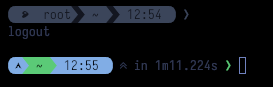

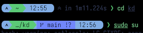

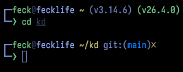


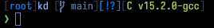

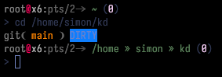

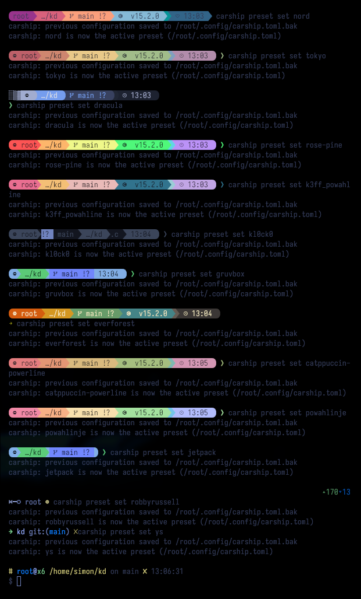

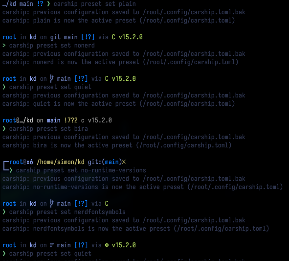

### Inspired by 
#### starship.rs

### Screenshots

`agnoster`


`animated`

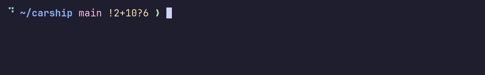

`aurora`


`bira`

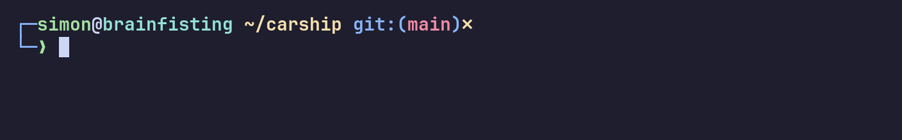

`bracketed-segments`

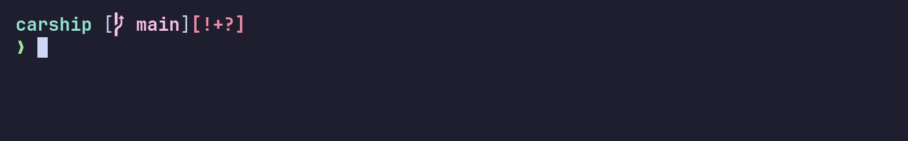

`catppuccin-powerline`


`cobalt`


`codex`

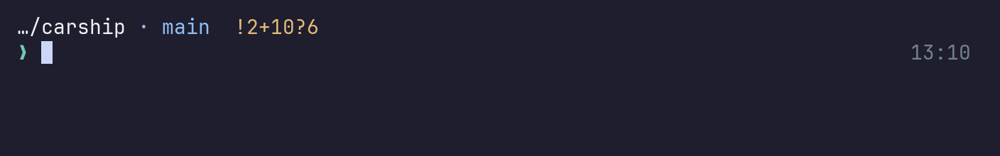

`codex-maximal`

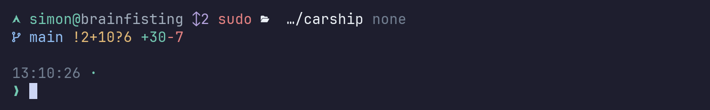

`codex-minimal`

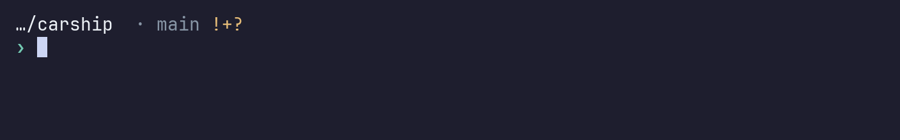

`cute`


`cyberpunk`


`dracula`


`dscdnc-ember`


`dscdnc-forest`


`dscdnc-mono`


`dscdnc-ocean`


`dscdnc`


`ember`

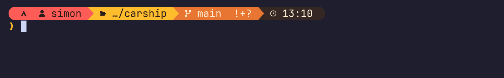

`everforest`


`gruvbox`

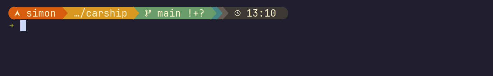

`jetpack`

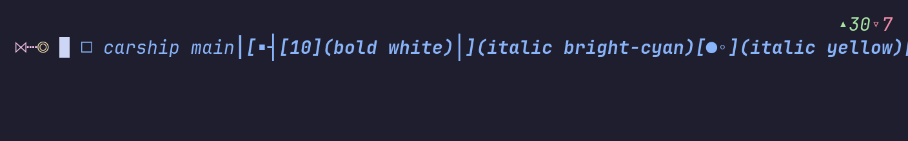

`k3ff_powahline`


`kanagawa`


`kl0ck0`


`minimal`


`neon-night`


`nerdfontsymbols`

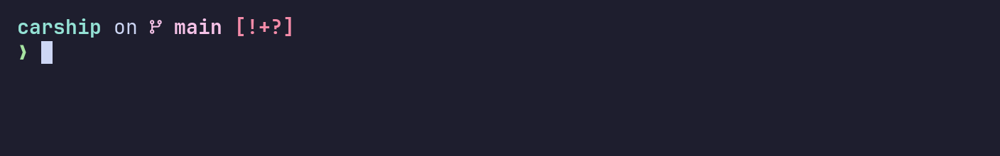

`nonerd`


`nord`


`no-runtime-versions`

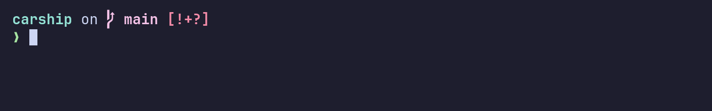

`pastel`


`plain`

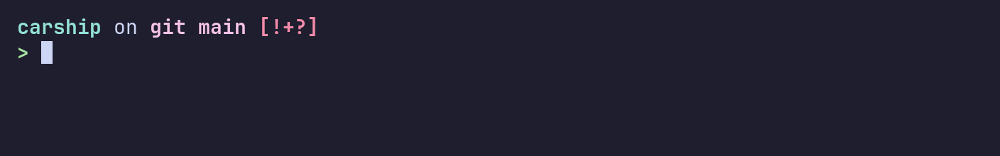

`powahlinje`


`pure`

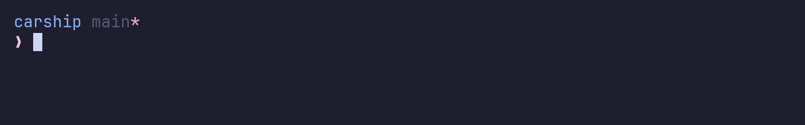

`quiet`

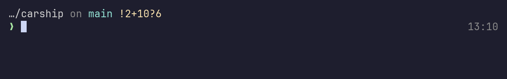

`robbyrussell`

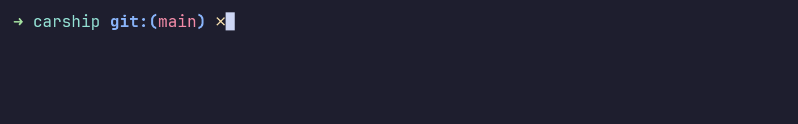

`rose-pine`


`sakura`


`synthwave`


`times`


`tokyo`


`toxic`


`trapd00r`

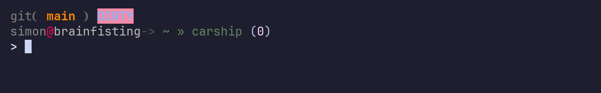

`two-line`

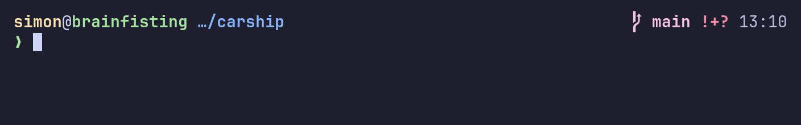

`wezm`

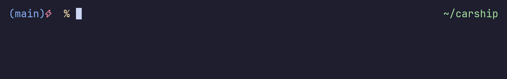

`ys`

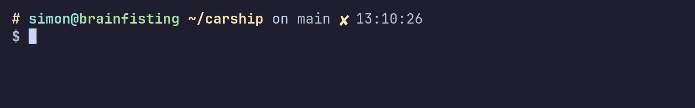
